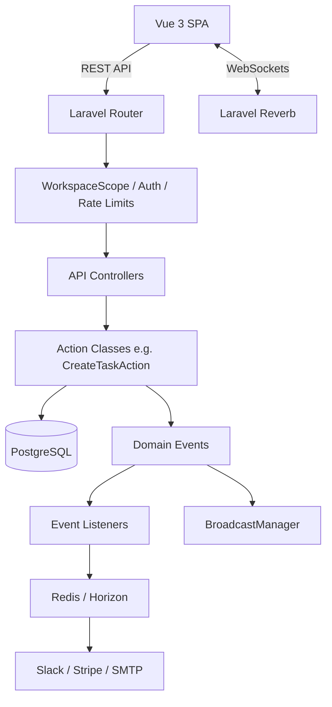

<p align="center">
  
</p>

<h1 align="center">FocusFlow</h1>

<p align="center">
  <strong>A high-performance, multi-tenant team productivity SaaS built with Laravel 11.</strong>
</p>

<p align="center">
  <a href="https://github.com/dreamymc/focusflow/actions"></a>
  <a href="https://github.com/dreamymc/focusflow/actions"></a>
  <a href="https://phpstan.org/"></a>
  <a href="https://laravel.com/"></a>
  <a href="https://vuejs.org/"></a>
</p>

---

## 🚀 Overview

**FocusFlow** is a modern project management platform designed for teams. It features deep multi-tenancy, real-time collaboration via WebSockets, and a robust API-driven architecture. 

It was built as a comprehensive portfolio project demonstrating senior-level Laravel architecture, test-driven development (TDD), and modern SaaS best practices.

### 🎥 Watch the Demo
*(Placeholder for 2-minute Loom Video URL)*

### 🌍 Live Preview
*(Placeholder for Production Deployment URL)*

---

## ✨ Features

- **Multi-Tenant Architecture**: Complete data isolation using scoped pivot tables (`workspace_user`) and dynamic Eloquent Global Scopes.
- **Real-Time Collaboration**: Live task updates (assigned, moved, commented) and presence channels using **Laravel Reverb**.
- **Role-Based Access Control (RBAC)**: Fine-grained permissions using Policies and Gates (Admin, Member, Viewer).
- **Stripe Billing Integration**: Pro vs Free tiers using **Laravel Cashier** with webhook processing.
- **Background Processing**: Redis-backed queues managed by **Laravel Horizon** for email digests and Slack webhook notifications.
- **100% Test Coverage**: Developed using Strict TDD with **Pest PHP**. Fully automated CI pipeline.

---

## 🏗 Architecture

FocusFlow follows the **Action-Domain-Responder (ADR)** pattern over traditional MVC to keep controllers thin and logic highly testable.



👉 Read the full [Architecture Decision Record (ADR)](docs/ARCHITECTURE.md) for a deep dive into the design patterns.  
👉 Review the complete [API Documentation](docs/API.md) for endpoint details.

---

## 💻 Quick Start (Docker)

To get FocusFlow running locally in under 5 minutes, you only need Docker and PHP installed.

### 1. Clone & Setup
```bash
git clone https://github.com/dreamymc/focusflow.git
cd focusflow
composer install
cp .env.example .env
php artisan key:generate
```

### 2. Boot Services
Start the required external services (PostgreSQL, Redis) via Docker Compose:
```bash
docker-compose up -d
```

### 3. Migrate & Seed
Run migrations and populate the database with realistic sample data:
```bash
php artisan migrate:fresh --seed --class=DemoSeeder
```

### 4. Start the Application
Run the local development servers:
```bash
# Terminal 1: Laravel API
php artisan serve

# Terminal 2: Reverb WebSockets
php artisan reverb:start

# Terminal 3: Vite Frontend
npm install && npm run dev
```

---

## 🧪 Testing

The codebase maintains **100% test coverage** using Pest PHP. The test suite includes full feature testing for WebSockets and Stripe Webhooks without requiring external services.

```bash
# Run the test suite
php artisan test

# Run with coverage report
php artisan test --coverage
```

## 📄 License
This project is open-sourced software licensed under the [MIT license](https://opensource.org/licenses/MIT).
