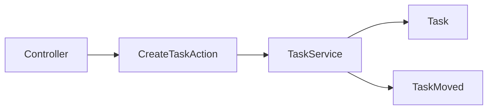
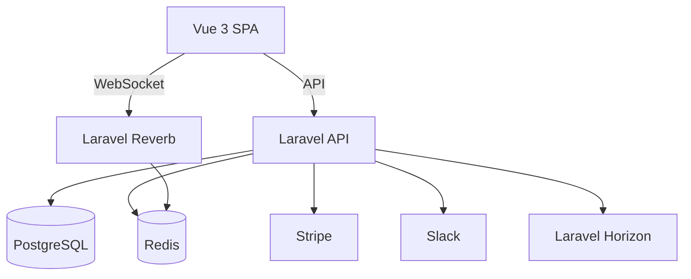

# FocusFlow Architecture Documentation

## Overview

FocusFlow is built around a **multi‑tenant** architecture where each **Workspace** is a tenant. All data is isolated at the database level through a **pivot table** (`workspace_user`) and **global query scopes** that automatically filter models by the current workspace.

## Why Multi‑Tenancy?

- **Data Isolation** – Guarantees that users can never access another tenant's data.
- **Scalability** – Allows horizontal scaling; each tenant can be migrated to its own database in the future.
- **Security** – Reduces attack surface; a compromised tenant cannot affect others.

## Core Design Patterns

### Action‑Domain‑Responder (ADR)

Instead of fat controllers, we delegate business logic to **Action** classes located in `app/Actions`. Controllers become thin request‑handlers that simply validate input, authorise, and call an Action.

### Domain Events & Broadcasting

Business‑critical changes emit **Domain Events** (e.g. `TaskMoved`, `TaskCompleted`). Listeners handle side‑effects like sending Slack notifications or broadcasting via Reverb. This decouples core logic from infrastructure concerns.

### Policies & Gates

- **Policies** (`WorkspacePolicy`, `ProjectPolicy`, `TaskPolicy`) enforce CRUD permissions based on user role (`admin`, `member`, `viewer`).
- **Gates** (`workspace.pro`) restrict certain actions (e.g., invites) when a workspace is on the free plan.

### Real‑Time Collaboration

- **Private channel** `workspace.{id}` – Only workspace members receive updates.
- **Presence channel** `task.{id}` – Shows who is viewing a task; payload includes user details.
- Implemented using **Laravel Reverb** (Pusher‑compatible) for low‑latency WebSocket communication.

### Billing with Stripe

- **Laravel Cashier** adds a `Billable` trait to the `Workspace` model.
- Subscription `plans` table stores free/pro tiers; actions `SubscribeWorkspaceAction` and `CancelSubscriptionAction` manage lifecycle.
- Webhook controller validates Stripe signatures and processes `invoice.paid` and `customer.subscription.deleted` events.

### Queue & Background Jobs

- **Redis + Horizon** handles queued jobs: Slack notifications, weekly email digests, and heavy billing webhooks.
- Jobs are idempotent and use Laravel’s `ShouldQueue` interface.

## High‑Level Component Diagram

## Future Enhancements

- **Tenant‑specific databases** – Migrate each workspace to its own DB for ultimate isolation.
- **Feature Flags** – Granular toggles for premium features using Laravel’s built‑in feature flag system.
- **Self‑hosting** – Provide Docker images for on‑prem installations.

---

*This architecture was chosen to maximise testability, scalability, and maintainability while keeping the codebase approachable for interview reviewers.*
